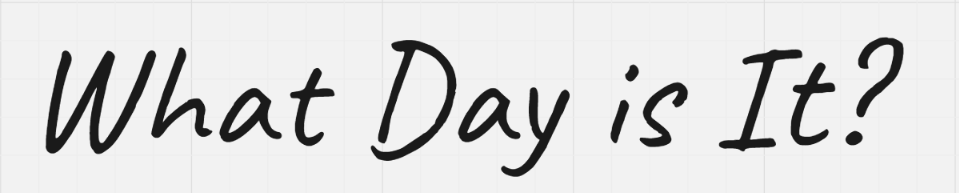
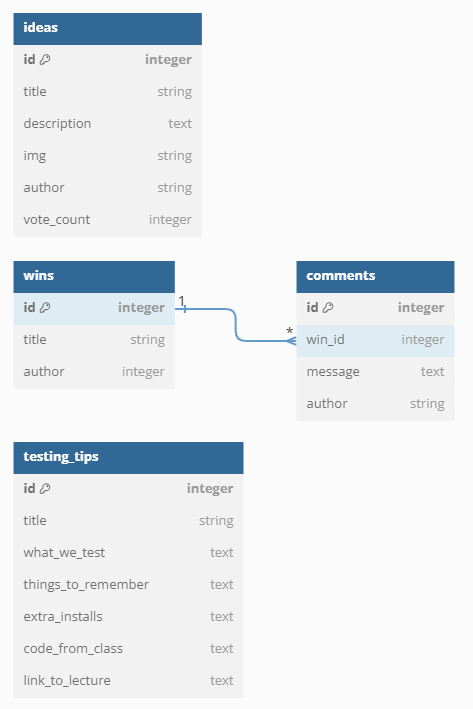

---

Are you a tired bootcamp student? Never fear, this project provides all the handy tools a bootcamper needs throughout the week. Not least of all the current day!

## Setup

### 0. Cloning and installation

- [ ] Clone this repo, navigate to it, install packages, and start the server with `npm run dev`
  <details style="padding-left: 2em">
    <summary>Tip</summary>

    You may also want to start a new branch
    ```sh
    cd what-day-is-it
    npm i
    git checkout -b <branchname>
    npm run dev
    ```
  </details>

<details>
  <summary>More about using <code>npm</code> vs <code>npx</code></summary>

  - When running knex, run `npm run knex <command>`, e.g. `npm run knex migrate:latest` rather than using `npx`
</details>

---

## Building Blocks
---

### 1. Our user stories

#### MVP

- As a user I want to be able to click on a button so that I can find out what day it is (done!)
- As a user I want to see an affirmation to help me be mindful
- As a user I want to see all of Jen's testing tips and be able to select individual topics (done!)
- As a user I want to be able to see a list of everyone's wins for the week, with title and author
- As a user I want to see a display of all of the project ideas from other users
- As a user I want to see a collection of images from an image API
- As a user I want to see a page with information about the app (done!)

#### MVP +

- As a user I want to be able to click on a button so that I can find out what day it is (done!)
- As a user I want to see an affirmation to help me be mindful
- As a user I want to see all of Jen's testing tips and be able to select individual topics (done!)
- As a user I want to be able to see a list of everyone's wins for the week, with title and author
- As a user I want to see a display of all of the project ideas from other users
- As a user I want to see a collection of images from an image API
- As a user I want to see a page with information about the app (done!)

#### Stretch

- As a user I want to be able to click on a button so that I can find out what day it is (done!)
- As a user I want to see an affirmation to help me be mindful
- As a user I want to see all of Jen's testing tips and be able to select individual topics (done!)
- As a user I want to be able to see a list of everyone's wins for the week, with title and author
- As a user I want to see a display of all of the project ideas from other users
- As a user I want to see a collection of images from an image API
- As a user I want to see a page with information about the app (done!)

### 2. Our tech stack

#### Core

- React, React Query, React Router
- Tailwind, PostCSS
- Express, SuperAgent
- Knex, SQLite3
- Vite, Typescript

#### Testing

- Vitest
- Testing Library 
- Supertest 
- Nock 
- React Router Dom

#### With extras from

- FontAwesome
- RadixUI, Headless UI React, Heroicons
- Unique Names Generator (@joaomoreno)
- React Jdenticon
- OpenAI, Langchain

#### Honorable Extension Mention

- Tailwind CSS IntelliSense

### 3. Our theme


Inspired by a calming sunset and the wholesome VSCode theme [Noctis](https://marketplace.visualstudio.com/items?itemName=liviuschera.noctis)

### 4. Our DB Schema (for now)

Note that author is an autogenerated name for each user



<details>
<summary>ERD code</summary>

```
Table wins {
  id integer [primary key]
  title string
  author integer
}

Table comments {
  id integer [primary key]
  win_id integer
  message text
  author string
}

Table ideas {
  id integer [primary key]
  title string
  description text
  img string
  author string
  vote_count integer
}

Table testing_tips {
  id integer [primary key]
  title string
  what_we_test text
  things_to_remember text
  extra_installs text
  code_from_class text
  link_to_lecture text
}

Ref: comments.win_id > wins.id // many to one
```

</details>

---

## Snippets 🗓️

These are small snippets of code that may help you out. Note that this is not an exhaustive list, and you may need to mix and match concepts.

### Component

#### Fetch from Component

<details>
  <summary>Code:</summary>

```ts
// component.tsx
const { data: fruits, isLoading, isError } = useQuery({
  queryKey: ['fruits'], 
  queryFn: getFruits
})

if (isError) {
  return (/* ... */)
}

if (isLoading) {
  return (/* ... */)
}

return (/* ... */)
```

</details>

---

### API Client

#### Get Request

<details>
  <summary>Code:</summary>

```ts
// apis/fruits.ts
async function getFruits() {
  const response = await request
    .get('/api/v1/fruits')

  return response.body.fruits
}
```

</details>

### Express Routes

#### Getting Data (server-side)

<details>
  <summary>Code:</summary>

```ts
// server/routes/fruits.ts
router.get('/', (req, res) => {
  try {
    const fruits = await db.getFruits(userId)
    if(!fruits){
      res.status(400)
      return
    }

    // ...
    res.status(200).json({fruits})
  } catch (error) {
    // ...
    console.log(error.message)
    res.status(500).json({ message: 'There was an error loading the data'})
  }
})
```

</details>

---

### Database/Knex

#### Database Join

<details>
  <summary>Code:</summary>

```ts
// server/db/fuctions/reviews.ts
async function getFruits(): Promise<FruitWithComment[]> {
  //         table 1
  return (
    db('fruits')
      //     table 2     column 1     column 2
      .join('comments', 'fruits.id', 'comments.fruit_id')
      .select(
        // make sure column names end up being unique
        'fruits.id',
        'fruits.name',
        'fruits.color',
        'fruits.taste',
        'comments.tasteRating',
        'comments.textureRating',
        'comments.content'
      )
  )
}
```

</details>